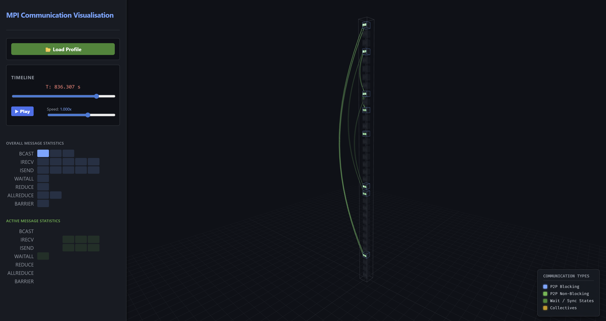

# Pyrite: MPI Communication Tracking and Visualiser

Pyrite is a lightweight MPI tracing and visual analytics toolchain for HPC applications.

This project intercepts MPI communication at runtime, records a compact binary trace, converts it into a streamed visualisation format, extracts common communication patterns and likely performance problems, and provides a web based rendering tool to display the result on a 3D representation of your physical hardware topology.

## Features

- **Zero-code instrumentation** with `LD_PRELOAD`
- **Low-overhead PMPI interception**
- **Compact binary trace output** (`.mpic`)
- **Chunked, streamed visualisation format** (`.mpix`)
- **Support for blocking, nonblocking, and collective MPI calls**
- **Analysis of communication patterns and performance issues**
- **3D hardware-aware visualisation** in the browser
- **Persistent 3D analytics overlays**
- **Issue-card-to-3D isolation**
- **Optional Fortran test coverage**

## Visualiser Interface


*The web-based visualiser rendering core-to-core network traffic using physical 3D tubes and directional arrowheads, alongside live message statistics and analytics overlays.*

## Project Layout

```text
mpi-comm-tracker/
├── CMakeLists.txt
├── src/
│   ├── CMakeLists.txt
│   ├── mpi_communication_tracking.c
│   └── mpi_communication_tracking.h
├── tools/
│   ├── mpi_data_parser.py
│   ├── topology_generator.py
│   └── slurm_topology_generator.py
├── vis/
│   ├── index.html
│   ├── style.css
│   ├── visualiser.js
│   ├── analytics.js
│   ├── analytics-3d.js
│   └── analytics-controls.js
├── tests/
│   ├── CMakeLists.txt
│   ├── ctest_driver.py
│   ├── trace_parser.py
│   ├── test_*.c
│   └── test_*.f90
└── docs/
    └── developer-guide.md
```

## Quick Start

### 1. Build

```bash
mkdir build
cd build
cmake ..
make
```

This produces:

```text
build/src/libmpi_comm_tracker.so
```

### 2. Run an MPI application under the tracker

```bash
LD_PRELOAD=/path/to/build/src/libmpi_comm_tracker.so mpirun -n 16 ./your_mpi_application
```

At `MPI_Finalize`, rank 0 writes a trace file like:

```text
your_mpi_application-YYYYMMDDHHMMSS.mpic
```

### 3. Generate or provide a hardware map

Optional, but recommended for meaningful 3D placement.

#### From Slurm

```bash
scontrol show topo > my_topo.txt
python tools/slurm_topology_generator.py my_topo.txt --racks_per_cab 4 --out hardware_map.json
```

#### Synthetic

```bash
python tools/topology_generator.py \
  --cabinets 2 \
  --racks 2 \
  --nodes 16 \
  --cpus 2 \
  --cores 32 \
  --system_name "My Local Cluster"
```

### 4. Parse and analyse the trace

```bash
python tools/mpi_data_parser.py your_mpi_application-YYYYMMDDHHMMSS.mpic hardware_map.json
```

This creates:

```text
your_mpi_application-YYYYMMDDHHMMSS.mpix
```

### 5. Open the visualiser

Open:

```text
vis/index.html
```

Then load the generated `.mpix` file.

---

## What the Parser Produces

The `.mpix` container includes:

- metadata
- topology
- binned message statistics
- hardware blueprint
- extracted analytics
- compressed time chunks

The analysis layer includes:

- top communicating ranks
- hottest sender/receiver links
- collective root summaries
- barrier skew estimates
- time-window / phase summaries
- detected communication patterns
- heuristic performance issues

---

## Visual Analytics

The frontend provides:

- a 3D hardware view
- timeline playback
- overall and active message statistics
- analytics cards
- persistent 3D overlays for:
  - issue-related ranks
  - hotspot links
  - collective roots
  - top ranks
  - pattern-related highlights
- issue-card-to-3D isolation
- analytics legend and highlight filters

---

## Supported MPI Calls

### Point-to-point
- `MPI_Send`
- `MPI_Recv`
- `MPI_Bsend`
- `MPI_Ssend`
- `MPI_Rsend`
- `MPI_Isend`
- `MPI_Ibsend`
- `MPI_Issend`
- `MPI_Irsend`
- `MPI_Irecv`
- `MPI_Sendrecv`

### Completion / synchronization
- `MPI_Wait`
- `MPI_Waitall`
- `MPI_Waitany`
- `MPI_Waitsome`
- `MPI_Test`
- `MPI_Testany`
- `MPI_Testall`
- `MPI_Testsome`
- `MPI_Barrier`

### Collectives
- `MPI_Bcast`
- `MPI_Reduce`
- `MPI_Allreduce`
- `MPI_Gather`
- `MPI_Scatter`
- `MPI_Allgather`

---

## Running Tests

```bash
cd build
ctest --output-on-failure
```

Optional Fortran test support:

```bash
cmake -S . -B build -DMPI_TRACE_FORTRAN_TESTS=AUTO
cmake -S . -B build -DMPI_TRACE_FORTRAN_TESTS=ON
cmake -S . -B build -DMPI_TRACE_FORTRAN_TESTS=OFF
```

---

## Limitations

- Communicator identity is not yet stored explicitly in the trace format, meaning we only record global ranks for communications and do not differentiate between communicators
- Some collective behaviour is approximated in the visualisation to make it visible 
- The analytic functionality is currently based on heuristic approaches, not formal proof based functionality
- Persistent MPI requests are not yet fully modelled
- Thread safety/heavy `MPI_THREAD_MULTIPLE` usage is not yet tested or ensured

---

## Documentation

For internal details, trace format notes, parser behaviour, frontend module layout, analytics overlays, testing, and extension guidance, see [docs/developer-guide.md](docs/developer-guide.md).

## Authors
This has been developed by Adrian Jackson.

## License

Apache 2.0. See [LICENSE](LICENSE).
